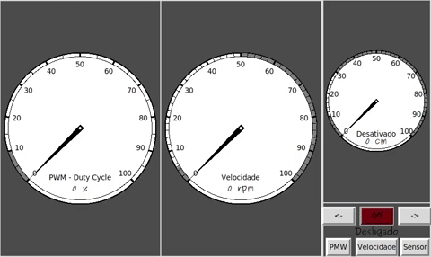

# Velocity Control user interface for raspberry pi

Graphical interface in python to control the velocity and direction of a dc motor using an PI controller.
- There are 3 possible ways to control its velocity
  - PWM duty cycle
  - Velocity PI controller 
  - Distance sensor
    
### Interface example

### Project assembly

## IoT Upade

New implementation where it is possible to control the motor remotlly throught the internet.
In the interface it is possible to selec local or remote control. Using [ubidots](https://ubidots.com/) platform it is possible performing PULL and GET request to update the motor velocity and direction.

